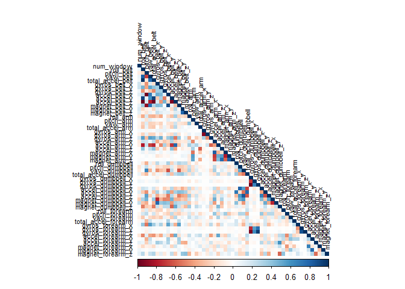

``` r
knitr::opts_chunk$set(warning = FALSE, message = FALSE)
```

# Practical Machine Learning - Prediction Assignment

## Overview

This is the report of Peer Assessment project from Coursera’s course
Practical Machine Learning. This markdown document was built in RStudio,
using its knitr functions and published in md (markdown) format.

## Background

Using devices such as Jawbone Up, Nike FuelBand, and Fitbit it is now
possible to collect a large amount of data about personal activity
relatively inexpensively. These type of devices are part of the
quantified self movement – a group of enthusiasts who take measurements
about themselves regularly to improve their health, to find patterns in
their behavior, or because they are tech geeks. One thing that people
regularly do is quantify how much of a particular activity they do, but
they rarely quantify how well they do it. In this project, your goal
will be to use data from accelerometers on the belt, forearm, arm, and
dumbell of 6 participants. They were asked to perform barbell lifts
correctly and incorrectly in 5 different ways.

The training data for this project are available here:

<https://d396qusza40orc.cloudfront.net/predmachlearn/pml-training.csv>

The test data are available here:

<https://d396qusza40orc.cloudfront.net/predmachlearn/pml-testing.csv>

## Data Loading and Cleaning

Load the neccessary library

``` r
library(caret)
library(corrplot)
```

We load the training and testing data from the url provided. Then, we
further split the original training data to train and validation set
with 80% training set data. The validation set (20% data) will be used
to select the best model later.

``` r
train_url <- "http://d396qusza40orc.cloudfront.net/predmachlearn/pml-training.csv"
test_url <- "http://d396qusza40orc.cloudfront.net/predmachlearn/pml-testing.csv"

df_train <- read.csv(url(train_url)) # The downloaded train data
df_test <- read.csv(url(test_url)) # The downloaded test set

# Split the train data to train set and validation set at 80/20
set.seed(100)
label <- createDataPartition(df_train$classe, p = 0.8, list = FALSE)
train_set <- df_train[label, ]
validation_set <- df_train[-label, ]

dim(train_set)
```

    ## [1] 15699   160

``` r
dim(validation_set)
```

    ## [1] 3923  160

``` r
dim(df_test)
```

    ## [1]  20 160

Remove the first five variables with identifications from all dataset
include train set, validation set and test data.

``` r
train_set <- train_set[ , -(1:5)]
validation_set <- validation_set[ , -(1:5)]
df_test <- df_test[ , -(1:5)]
```

We check the NA values in the train set which will be used to train the
model

``` r
colSums(is.na(train_set))
```

    ##               new_window               num_window                roll_belt 
    ##                        0                        0                        0 
    ##               pitch_belt                 yaw_belt         total_accel_belt 
    ##                        0                        0                        0 
    ##       kurtosis_roll_belt      kurtosis_picth_belt        kurtosis_yaw_belt 
    ##                        0                        0                        0 
    ##       skewness_roll_belt     skewness_roll_belt.1        skewness_yaw_belt 
    ##                        0                        0                        0 
    ##            max_roll_belt           max_picth_belt             max_yaw_belt 
    ##                    15385                    15385                        0 
    ##            min_roll_belt           min_pitch_belt             min_yaw_belt 
    ##                    15385                    15385                        0 
    ##      amplitude_roll_belt     amplitude_pitch_belt       amplitude_yaw_belt 
    ##                    15385                    15385                        0 
    ##     var_total_accel_belt            avg_roll_belt         stddev_roll_belt 
    ##                    15385                    15385                    15385 
    ##            var_roll_belt           avg_pitch_belt        stddev_pitch_belt 
    ##                    15385                    15385                    15385 
    ##           var_pitch_belt             avg_yaw_belt          stddev_yaw_belt 
    ##                    15385                    15385                    15385 
    ##             var_yaw_belt             gyros_belt_x             gyros_belt_y 
    ##                    15385                        0                        0 
    ##             gyros_belt_z             accel_belt_x             accel_belt_y 
    ##                        0                        0                        0 
    ##             accel_belt_z            magnet_belt_x            magnet_belt_y 
    ##                        0                        0                        0 
    ##            magnet_belt_z                 roll_arm                pitch_arm 
    ##                        0                        0                        0 
    ##                  yaw_arm          total_accel_arm            var_accel_arm 
    ##                        0                        0                    15385 
    ##             avg_roll_arm          stddev_roll_arm             var_roll_arm 
    ##                    15385                    15385                    15385 
    ##            avg_pitch_arm         stddev_pitch_arm            var_pitch_arm 
    ##                    15385                    15385                    15385 
    ##              avg_yaw_arm           stddev_yaw_arm              var_yaw_arm 
    ##                    15385                    15385                    15385 
    ##              gyros_arm_x              gyros_arm_y              gyros_arm_z 
    ##                        0                        0                        0 
    ##              accel_arm_x              accel_arm_y              accel_arm_z 
    ##                        0                        0                        0 
    ##             magnet_arm_x             magnet_arm_y             magnet_arm_z 
    ##                        0                        0                        0 
    ##        kurtosis_roll_arm       kurtosis_picth_arm         kurtosis_yaw_arm 
    ##                        0                        0                        0 
    ##        skewness_roll_arm       skewness_pitch_arm         skewness_yaw_arm 
    ##                        0                        0                        0 
    ##             max_roll_arm            max_picth_arm              max_yaw_arm 
    ##                    15385                    15385                    15385 
    ##             min_roll_arm            min_pitch_arm              min_yaw_arm 
    ##                    15385                    15385                    15385 
    ##       amplitude_roll_arm      amplitude_pitch_arm        amplitude_yaw_arm 
    ##                    15385                    15385                    15385 
    ##            roll_dumbbell           pitch_dumbbell             yaw_dumbbell 
    ##                        0                        0                        0 
    ##   kurtosis_roll_dumbbell  kurtosis_picth_dumbbell    kurtosis_yaw_dumbbell 
    ##                        0                        0                        0 
    ##   skewness_roll_dumbbell  skewness_pitch_dumbbell    skewness_yaw_dumbbell 
    ##                        0                        0                        0 
    ##        max_roll_dumbbell       max_picth_dumbbell         max_yaw_dumbbell 
    ##                    15385                    15385                        0 
    ##        min_roll_dumbbell       min_pitch_dumbbell         min_yaw_dumbbell 
    ##                    15385                    15385                        0 
    ##  amplitude_roll_dumbbell amplitude_pitch_dumbbell   amplitude_yaw_dumbbell 
    ##                    15385                    15385                        0 
    ##     total_accel_dumbbell       var_accel_dumbbell        avg_roll_dumbbell 
    ##                        0                    15385                    15385 
    ##     stddev_roll_dumbbell        var_roll_dumbbell       avg_pitch_dumbbell 
    ##                    15385                    15385                    15385 
    ##    stddev_pitch_dumbbell       var_pitch_dumbbell         avg_yaw_dumbbell 
    ##                    15385                    15385                    15385 
    ##      stddev_yaw_dumbbell         var_yaw_dumbbell         gyros_dumbbell_x 
    ##                    15385                    15385                        0 
    ##         gyros_dumbbell_y         gyros_dumbbell_z         accel_dumbbell_x 
    ##                        0                        0                        0 
    ##         accel_dumbbell_y         accel_dumbbell_z        magnet_dumbbell_x 
    ##                        0                        0                        0 
    ##        magnet_dumbbell_y        magnet_dumbbell_z             roll_forearm 
    ##                        0                        0                        0 
    ##            pitch_forearm              yaw_forearm    kurtosis_roll_forearm 
    ##                        0                        0                        0 
    ##   kurtosis_picth_forearm     kurtosis_yaw_forearm    skewness_roll_forearm 
    ##                        0                        0                        0 
    ##   skewness_pitch_forearm     skewness_yaw_forearm         max_roll_forearm 
    ##                        0                        0                    15385 
    ##        max_picth_forearm          max_yaw_forearm         min_roll_forearm 
    ##                    15385                        0                    15385 
    ##        min_pitch_forearm          min_yaw_forearm   amplitude_roll_forearm 
    ##                    15385                        0                    15385 
    ##  amplitude_pitch_forearm    amplitude_yaw_forearm      total_accel_forearm 
    ##                    15385                        0                        0 
    ##        var_accel_forearm         avg_roll_forearm      stddev_roll_forearm 
    ##                    15385                    15385                    15385 
    ##         var_roll_forearm        avg_pitch_forearm     stddev_pitch_forearm 
    ##                    15385                    15385                    15385 
    ##        var_pitch_forearm          avg_yaw_forearm       stddev_yaw_forearm 
    ##                    15385                    15385                    15385 
    ##          var_yaw_forearm          gyros_forearm_x          gyros_forearm_y 
    ##                    15385                        0                        0 
    ##          gyros_forearm_z          accel_forearm_x          accel_forearm_y 
    ##                        0                        0                        0 
    ##          accel_forearm_z         magnet_forearm_x         magnet_forearm_y 
    ##                        0                        0                        0 
    ##         magnet_forearm_z                   classe 
    ##                        0                        0

We noticed a large number of NA and variables with near-zero-variance
(NZV) in the train dataset. Therefore, we will remove the NZV variables
and variables that are mostly NA (with the threshold of 90%):

``` r
nzv <- nearZeroVar(train_set)
train_set <- train_set[ , -nzv]

# based on the nzv from train set, we will remove the same variables from validation set and original testing set
validation_set <- validation_set[ , -nzv]
df_test <- df_test[ , -nzv]

# Remove the NA column at 90% threshold
na_var <- sapply(train_set, function(x) mean(is.na(x))) > 0.9
train_set <- train_set[ , na_var == FALSE]

# Based on na_var above, we also remove the same variables from the validation set and df_test(the original testing set)
validation_set <- validation_set[ , na_var == FALSE]
df_test <- df_test[ , na_var == FALSE]

dim(train_set)
```

    ## [1] 15699    54

``` r
dim(validation_set)
```

    ## [1] 3923   54

``` r
dim(df_test)
```

    ## [1] 20 54

## Data Exploration

Plot the correlation of variables. The darker squares correspond to
highly correlated variables.

``` r
corrMatrix <- cor(train_set[,-54])
corrplot(corrMatrix, method = "color", type = "lower", tl.cex = 0.7, tl.col = rgb(0,0,0))
```



## Train Predictive models

### Random Forest Classifier

We train the first model using Random forest Classifier with repeadted
cross validation repeatedcv. We use the metric ‘accuracy’ to compare the
model. To speed up the model training, we will use parallel processing
using multiple cores.

``` r
library(doParallel)
cl <- makePSOCKcluster(7)
registerDoParallel(cl)


control <- trainControl(method = "repeatedcv", number = 5, repeats = 2)
#Number randomely variable selected is mtry
mtry <- sqrt(ncol(train_set))

set.seed(100)
tunegrid <- expand.grid(.mtry=mtry)
rf_model <- train(classe~., 
                      data=train_set, 
                      method='rf', 
                      metric='Accuracy', 
                      tuneGrid=tunegrid, 
                      trControl=control)
print(rf_model)
```

    ## Random Forest 
    ## 
    ## 15699 samples
    ##    53 predictor
    ##     5 classes: 'A', 'B', 'C', 'D', 'E' 
    ## 
    ## No pre-processing
    ## Resampling: Cross-Validated (5 fold, repeated 2 times) 
    ## Summary of sample sizes: 12560, 12558, 12559, 12560, 12559, 12557, ... 
    ## Resampling results:
    ## 
    ##   Accuracy   Kappa    
    ##   0.9966238  0.9957292
    ## 
    ## Tuning parameter 'mtry' was held constant at a value of 7.348469

### Gradient Boosting Machine (GBM) Model

We will train a Gradient Boosting Machine (GBM) Model to compare the
resutl with the random forest model.

``` r
set.seed(100)
gbm_model <- train(classe~., data = train_set, 
                 method = "gbm", 
                 trControl = control,
                 ## This last option is actually one
                 ## for gbm() that passes through
                 verbose = FALSE)
print(gbm_model)
```

    ## Stochastic Gradient Boosting 
    ## 
    ## 15699 samples
    ##    53 predictor
    ##     5 classes: 'A', 'B', 'C', 'D', 'E' 
    ## 
    ## No pre-processing
    ## Resampling: Cross-Validated (5 fold, repeated 2 times) 
    ## Summary of sample sizes: 12560, 12558, 12559, 12560, 12559, 12557, ... 
    ## Resampling results across tuning parameters:
    ## 
    ##   interaction.depth  n.trees  Accuracy   Kappa    
    ##   1                   50      0.7613858  0.6972663
    ##   1                  100      0.8349888  0.7910455
    ##   1                  150      0.8719661  0.8379125
    ##   2                   50      0.8882094  0.8584636
    ##   2                  100      0.9433087  0.9282747
    ##   2                  150      0.9660802  0.9570856
    ##   3                   50      0.9348682  0.9175592
    ##   3                  100      0.9726407  0.9653892
    ##   3                  150      0.9878333  0.9846094
    ## 
    ## Tuning parameter 'shrinkage' was held constant at a value of 0.1
    ## 
    ## Tuning parameter 'n.minobsinnode' was held constant at a value of 10
    ## Accuracy was used to select the optimal model using the largest value.
    ## The final values used for the model were n.trees = 150, interaction.depth =
    ##  3, shrinkage = 0.1 and n.minobsinnode = 10.

``` r
stopCluster(cl)
```

## Compare the models using validation set

We compute the predictions of Random Forest(RF) model on validation set
and then compute the confusion matrix.The accuracy of the RF model is 99.85%.

``` r
predict_rf <- predict(rf_model, validation_set)
confMatrix_rf <- confusionMatrix(predict_rf, factor(validation_set$classe))

confMatrix_rf
```

    ## Confusion Matrix and Statistics
    ## 
    ##           Reference
    ## Prediction    A    B    C    D    E
    ##          A 1116    0    0    0    0
    ##          B    0  759    3    0    0
    ##          C    0    0  681    1    0
    ##          D    0    0    0  642    2
    ##          E    0    0    0    0  719
    ## 
    ## Overall Statistics
    ##                                           
    ##                Accuracy : 0.9985          
    ##                  95% CI : (0.9967, 0.9994)
    ##     No Information Rate : 0.2845          
    ##     P-Value [Acc > NIR] : < 2.2e-16       
    ##                                           
    ##                   Kappa : 0.9981          
    ##                                           
    ##  Mcnemar's Test P-Value : NA              
    ## 
    ## Statistics by Class:
    ## 
    ##                      Class: A Class: B Class: C Class: D Class: E
    ## Sensitivity            1.0000   1.0000   0.9956   0.9984   0.9972
    ## Specificity            1.0000   0.9991   0.9997   0.9994   1.0000
    ## Pos Pred Value         1.0000   0.9961   0.9985   0.9969   1.0000
    ## Neg Pred Value         1.0000   1.0000   0.9991   0.9997   0.9994
    ## Prevalence             0.2845   0.1935   0.1744   0.1639   0.1838
    ## Detection Rate         0.2845   0.1935   0.1736   0.1637   0.1833
    ## Detection Prevalence   0.2845   0.1942   0.1738   0.1642   0.1833
    ## Balanced Accuracy      1.0000   0.9995   0.9977   0.9989   0.9986

We compute the predictions of the GBM model on validation set and then
compute the confusion matrix.The accuracy of GBM Model is slightly lower
than the RF model.

``` r
predict_gbm <- predict(gbm_model, validation_set)
confMatrix_gbm <- confusionMatrix(predict_gbm, factor(validation_set$classe))

confMatrix_gbm
```

    ## Confusion Matrix and Statistics
    ## 
    ##           Reference
    ## Prediction    A    B    C    D    E
    ##          A 1113    6    0    2    0
    ##          B    3  749    7    3    2
    ##          C    0    3  673    5    1
    ##          D    0    1    3  633    5
    ##          E    0    0    1    0  713
    ## 
    ## Overall Statistics
    ##                                           
    ##                Accuracy : 0.9893          
    ##                  95% CI : (0.9856, 0.9923)
    ##     No Information Rate : 0.2845          
    ##     P-Value [Acc > NIR] : < 2.2e-16       
    ##                                           
    ##                   Kappa : 0.9865          
    ##                                           
    ##  Mcnemar's Test P-Value : NA              
    ## 
    ## Statistics by Class:
    ## 
    ##                      Class: A Class: B Class: C Class: D Class: E
    ## Sensitivity            0.9973   0.9868   0.9839   0.9844   0.9889
    ## Specificity            0.9971   0.9953   0.9972   0.9973   0.9997
    ## Pos Pred Value         0.9929   0.9804   0.9868   0.9860   0.9986
    ## Neg Pred Value         0.9989   0.9968   0.9966   0.9970   0.9975
    ## Prevalence             0.2845   0.1935   0.1744   0.1639   0.1838
    ## Detection Rate         0.2837   0.1909   0.1716   0.1614   0.1817
    ## Detection Prevalence   0.2858   0.1947   0.1738   0.1637   0.1820
    ## Balanced Accuracy      0.9972   0.9910   0.9906   0.9909   0.9943

## Predicting the final original Test Set Output

Since Random Forest (RF) model has the higher accuracy we will use the
Random Forest (RF) model to predict the the classe of the test set.

``` r
predict_final <- predict(rf_model, df_test)
predict_final
```

    ##  [1] B A B A A E D B A A B C B A E E A B B B
    ## Levels: A B C D E
